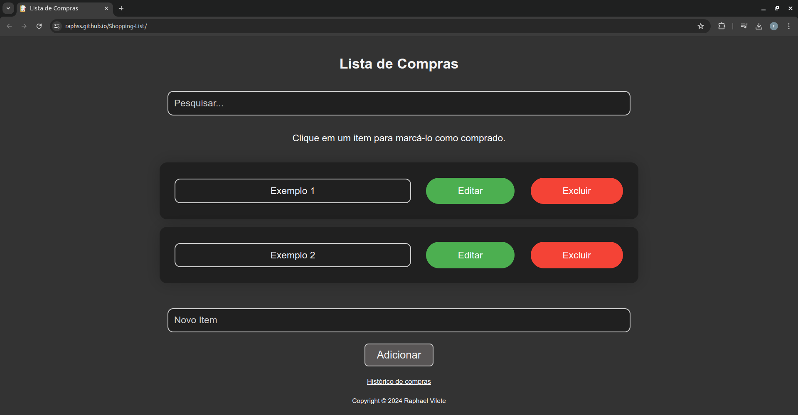

# Shopping-List

> Version 1.0

[![Live Website][url-image]][url]

    

## About

A responsive Shopping List website. Developed with HTML, CSS and JavaScript.

## How to Contribute

1. Fork the repository
2. Create a branch for your feature (git checkout -b feature/MyFeature)
3. Commit your changes (git commit -am 'Add a new feature')
4. Push to the branch (git push origin feature/MyFeature)
5. Open a Pull Request

## License

This project is licensed under the MIT License - see the [LICENSE](LICENSE) file for details.

## Contact

- Raphael Vilete - [raphvilete@gmail.com](mailto:raphvilete@gmail.com)

<!-- Markdown link & img dfn's -->
[url]: https://raphss.github.io/Shopping-List/
[url-image]: https://img.shields.io/badge/Live_Website-red
